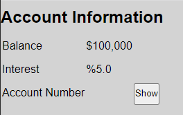
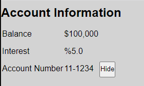

# JavaScript React Intro Assignments
All assignments are based on React functional components.  

[Component Type Reference](https://gitlab.com/mburolla/javascript-react-starter/-/blob/main/component-types.md)

# Ex. 1: Dollar Food Store
The React Component is our building block when creating React applications.  This assignment focuses on the architecting (structuring) our React web pages using simple React components.

Create the following React [Type 1](https://gitlab.com/mburolla/javascript-react-starter/-/blob/main/component-types.md) components for this [HTML](./src/TODO/DollarStore/index.html) and [CSS](./src/TODO/DollarStore/style.css):

- Menu
    - Food
    - Drink
    - Dessert
- Footer

The `Header` React component has been done for you.  It can be used as an example for the other React components you will create.

When you are finished, the Main React component will resemble the following and should produce the rendered output below:

```
<div className="Main">
    <Header />
    <Menu />
    <Footer />
</div>
```


Always keep the DevTools console open (ctl+shift+i).

When you are finished create a PR called `Ex. 1: Dollar Food Store`.

# Ex. 2: FootBook
First there was Facebook, now there is FootBook.  Its your turn to slice and dice.  Given the following UI:


Create [Type 1](https://gitlab.com/mburolla/javascript-react-starter/-/blob/main/component-types.md) React components that render this webpage and place them in your `Main` React component in your student directory.

Colors:
```
background-color: rgb(189, 189, 189);
background-color: rgb(83, 83, 255);
white
```

Always keep the DevTools console open (ctl+shift+i).

When you are finished create a PR called `Ex. 2: FootBook`.

# Ex. 3: Tweet Storm 
React Components have properties, commonly knows as props.  Props allow us to send data INTO a React Component.  Prop data in the React Component is READ ONLY and cannot be changed.  The term "prop drilling" is used when we pass data from multiple child components.  Properties are seen in our [Type 2](https://gitlab.com/mburolla/javascript-react-starter/-/blob/main/src/comps/Type2.js) components.

Create a `Tweets` parent component that contains many `Tweet` components such that it is consumed by the `Main` component in the following manner:

```
<div className="Main">
    <Tweets />
</div>
```

The `Tweet` child component is consumed by the `Tweets` parent component in the following manner:

```
<div className="Tweets">
    <div>Tweet Storm</div>
    <Tweet message="It's payday!!!" color="green"/>
    <Tweet message="I just bought a new car!" color="yellow" />
    <Tweet message="I just smashed my new car." color="red" />
</div>
```
Note: message and color are props of the `Tweet` component.

Rendered UI:


Always keep the DevTools console open (ctl+shift+i).

When you are finished create a PR called `Ex. 3: Tweet Storm`.

# Ex. 4: Like Counter
Callback arrow functions are used to send data from a child component back to the parent component.

The [Type 9](https://gitlab.com/mburolla/javascript-react-starter/-/blob/main/src/comps/Type9.js) component shows how handle a callback function when a [child](https://gitlab.com/mburolla/javascript-react-starter/-/blob/main/src/comps/Child.js) component fires a callback function to the parent.

Copy and paste the `Tweets` and `Tweet` components to the Ex4 directory in your Student directory.  Modify the `Tweet` component to include a 'Like' button.  The `Tweets` component has [state](https://gitlab.com/mburolla/javascript-react-starter/-/blob/main/src/comps/Type9.js#L8) that keeps track of the total number of likes. 

Rendered UI:


Always keep the DevTools console open (ctl+shift+i).

When you are finished create a PR called `Ex. 4: Like Counter`.

# Ex. 5: Account Information
React allows us to show/hide items from the user.  As developers we can choose to simpy hide the elements or remove them (unload) from the DOM.  The [Type 11](https://gitlab.com/mburolla/javascript-react-starter/-/blob/main/src/comps/Type11.js) component shows how these tasks are accomplished.

Create a React component called `Account` that contains a table and a button.  The button shows/hides the Account Number.  The text of the button should change to "Show" or "Hide"

Rendered UI:




Always keep the DevTools console open (ctl+shift+i).

When you are finished create a PR called `Ex. 5: Account Information`.

# Ex. 6: Sentence Builder

#### Part A

React allows us to get "handles" to DOM elements.  Because of this, there is no reason to use `getElementById()` in our React applications. 

[Type 6](https://gitlab.com/mburolla/javascript-react-starter/-/blob/main/src/comps/Type6.js) components show how we can use the `useRef()` hook to get a reference to a DOM element.  NOTE: `useRef()` has two different use cases.  We are ignoring the other use case for now.  Also, do not forget to use the `.current` property when using `useRef()`.

Create a React component called `SentenceBuilder` which builds a sentence using the `useState()` and `useRef()` hooks.  The `Add Word` button adds a word to the sentence and the `Reset` button clears the sentence so that the user can build a new sentence. 

Rendered UI:


#### Part B

- Disable the buttons if no text is present in the textbox.  Enable the buttons if one or more characters are in the textbox.  
- Add a word counter to the UI that displays the number of words in the sentence.

Always keep the DevTools console open (ctl+shift+i).

When you are finished create a PR called `Ex. 6: Sentence Builder`.
